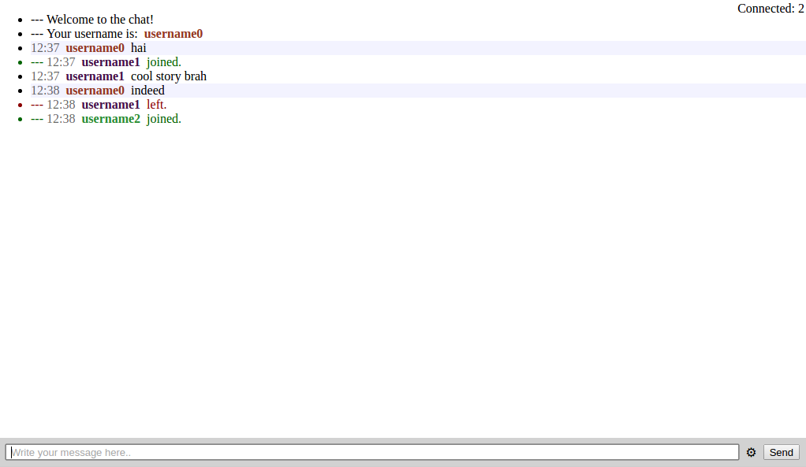

# Try it out #

[http://chat4321.herokuapp.com/](http://chat4321.herokuapp.com/)

# Build #

Requires:

- `xcode` for the iOS client.
- `node` for the web client.
- `swift` for the server section.

| Command | Description |
|---------|-------------|
| `npm install` | Install the web client and build dependencies. |
| `npm run dev` | Compiles and runs both the web client and server builds (go to `localhost:8000/` to try it out). |
| `npm run build` | Builds the release version of the server application. |

Open `/Client_iOS/chat.xcodeproj` to check the iOS client project.

# Messages #

*Note:* &#124; is the pipe character, but isn't being rendered correctly in bitbucket.

## Client ##

| Message | Description |
|---------|-------------|
| U&#124;(username) | Tells you what is your username. |
| C&#124;(connectedCount) | Tells you the number of connected users at the moment. |
| M&#124;(time)&#124;(username)&#124;(message) | Received a message. |
| J&#124;(username) | A user joined the chat. |
| L&#124;(username) | A user left the chat. |

## Server ##

| Message | Description |
|---------|-------------|
| R | A client is ready, send his username and the last chat messages. |
| M&#124;(username)&#124;(message) | Received a message. |
